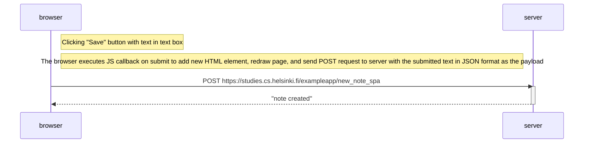

```mermaid
sequenceDiagram
    participant browser
    participant server

    Note right of browser: Clicking "Save" button with text in text box
    Note right of browser: The browser executes JS callback on submit to add new HTML element, redraw page, and send POST request to server with the submitted text in JSON format as the payload

    browser->>server: POST https://studies.cs.helsinki.fi/exampleapp/new_note_spa
    activate server
    server-->>browser: "note created" 
    deactivate server

```